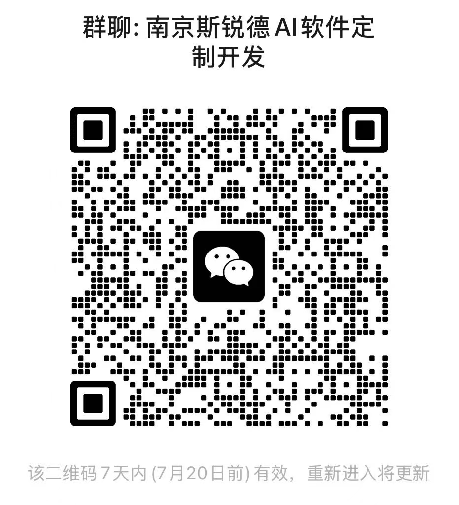
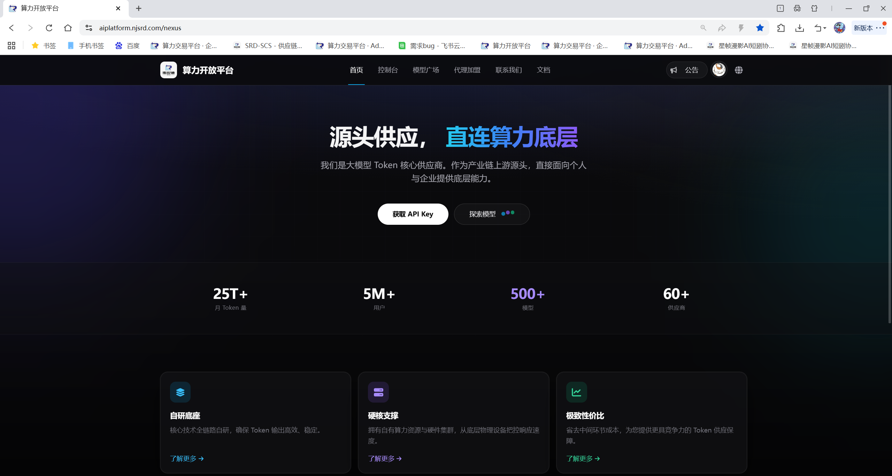
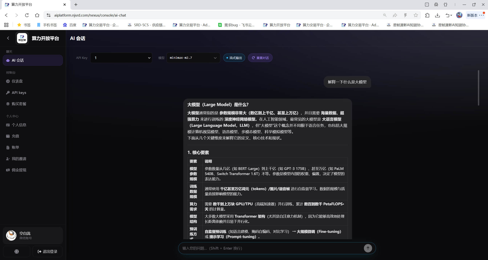
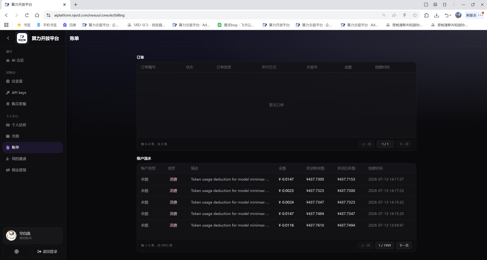
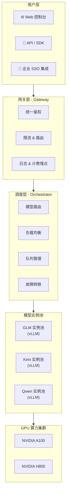

# 🚀 Token 开放平台

> 一站式大模型算力服务平台 —— 本地私有化部署，按量计费，开箱即用。

[](LICENSE)
[](https://aiplatform.njsrd.com/)
[]()

---

### 💬 加入社群

> 📱 扫码加入微信群，获取最新模型上线通知、优惠活动与技术交流。

<p align="center">
  
  <br/>
  <em>▲ 微信扫码加入交流群（如二维码过期请添加微信 zwl568633995）</em>
</p>

---

## 📖 项目简介

**Token 开放平台** 是一个面向企业与开发者的 AI 模型算力服务平台。我们通过自建 GPU 服务器集群私有化部署主流大语言模型，为用户提供稳定、安全、低延迟的模型推理服务。

> 用户无需昂贵的硬件投入和复杂的运维工作，只需注册账号，即可在 Web 控制台或通过标准 API 直接调用 **GLM-5.1**、**Kimi-K2.6**、**Qwen3.5/3.6 系列**、**GPT-4.1**、**Claude Sonnet**、**Gemini 2.5 Pro** 等 16 款头部大模型，按 Token 用量灵活计费。

---

## ✨ 核心优势

| 优势 | 说明 |
|------|------|
| 🔒 **数据安全** | 本地私有化部署，数据不出境，满足企业合规要求 |
| ⚡ **低延迟推理** | 自建 GPU 集群就近部署，毫秒级响应 |
| 🎯 **多模型聚合** | 一个平台接入所有主流模型，无需对接多家厂商 |
| 💰 **弹性计费** | 按实际 Token 用量付费，无最低消费，用多少付多少 |
| 🛠️ **开箱即用** | Web 控制台 + RESTful API，5 分钟即可接入业务 |
| 📊 **用量可视化** | 实时监控 Token 消耗、费用明细、调用日志 |

---

## 🖥️ 平台预览

### 🎬 操作演示

https://github.com/user-attachments/assets/c420e1cc-2ea6-4739-9de5-4dcfc96cff42

### 📸 界面截图

<p align="center">
  
  <br/>
  <em>▲ 控制台首页 — 模型选择与用量概览</em>
</p>

<p align="center">
  
  <br/>
  <em>▲ 在线对话 — 支持多模型切换与流式输出</em>
</p>

<p align="center">
  
  <br/>
  <em>▲ 用量面板 — Token 消耗与费用实时可见</em>
</p>

---

## 🤖 已接入模型（16 款）

### 通用对话（大参数旗舰）
| 模型 | 厂商 | 特点 |
|------|------|------|
| **glm-5.1** | 智谱 AI | 复杂推理、长文本理解、Agent 任务 |
| **kimi-k2.6** | Moonshot AI | 超长上下文、文档分析、深度研究 |
| **qwen3.5-122b-a10b** | 阿里巴巴 | 阿里旗舰大模型，120B 参数，复杂推理与创作 |
| **claude-sonnet-4-6** | Anthropic | 多语言对话、逻辑推理、创意写作 |
| **gpt-4.1** | OpenAI | 通用对话、代码辅助、知识问答 |
| **gemini-2.5-pro** | Google | 多模态理解、实时联网、长上下文 |

### 通用对话（性价比之选）
| 模型 | 厂商 | 特点 |
|------|------|------|
| **qwen3.5-35b-a3b** | 阿里巴巴 | 35B 参数，高性价比日常对话 |
| **qwen3.5-27b** | 阿里巴巴 | 轻量快速，响应迅速 |
| **qwen3.6-35b-a3b** | 阿里巴巴 | 最新 3.6 版本，35B 参数 |
| **qwen3.6-27b** | 阿里巴巴 | 轻量快速，低延迟 |
| **glm-4.7-flash** | 智谱 AI | 智谱轻量模型，极速响应 |
| **minimax-m2.7** | MiniMax | 多轮对话、角色扮演、内容生成 |
| **gemma-4-31b-it** | Google | 31B 参数，Google 开源模型，轻量通用 |

### 推理与代码
| 模型 | 特点 |
|------|------|
| **deepseek-r1-distill-qwen-32b** | 32B 参数，蒸馏 R1 推理能力，代码与数学推理 |
| **deepseek-v4-flash** | DeepSeek 轻量快速模型，推理与编程 |
| **qwen3.5-27b-claude-4.6-opus-reasoning-distilled** | 蒸馏 Claude 推理能力，复杂逻辑推理 |

> 📌 模型版本持续更新，支持为大型客户 **定制私有模型部署**。

---

## 🏗️ 技术架构



### 技术栈

- **推理引擎**: vLLM / TGI（高性能推理框架）
- **后端**: Python (FastAPI) / Go
- **前端**: React + TypeScript + TailwindCSS
- **数据库**: PostgreSQL + Redis
- **消息队列**: RabbitMQ
- **监控**: Prometheus + Grafana
- **容器化**: Docker + Kubernetes

---

## 🚀 快速开始

### 方式一：Web 控制台

1. 访问 [https://aiplatform.njsrd.com/nexus](https://aiplatform.njsrd.com/nexus) 注册账号
2. 在控制台获取 API Key
3. 选择模型，直接在线对话测试

### 方式二：API 调用

```bash
curl https://aiplatform.njsrd.com/llm/v1/chat/completions \
  -H "Content-Type: application/json" \
  -H "Authorization: Bearer YOUR_API_KEY" \
  -d '{
    "model": "glm-5.1",
    "messages": [{"role": "user", "content": "你好，请介绍一下自己"}],
    "temperature": 0.7
  }'
```

### 方式三：Python SDK

```python
from token_open_platform import Client

client = Client(api_key="YOUR_API_KEY")

response = client.chat.completions.create(
    model="glm-5.1",
    messages=[{"role": "user", "content": "用Python写一个快速排序"}]
)

print(response.choices[0].message.content)
```

---

## 💼 适用场景

- 🏢 **企业 AI 转型** — 为内部系统快速接入大模型能力
- 🌐 **AI 应用创业** — 低成本启动，无需自购 GPU
- 📚 **教育培训** — 高校 AI 课程实训、科研实验
- 🤖 **智能客服** — 接入现有客服系统，7×24 小时在线
- 📝 **内容生产** — 批量生成文案、翻译、摘要

---

## 📞 商业合作

我们支持以下合作模式：

- **API 调用**：标准按量计费，即开即用
- **专属实例**：独享 GPU 资源，更高并发，更低延迟
- **私有化部署**：部署到客户自有服务器，数据完全隔离
- **定制模型微调**：基于客户业务数据进行模型精调

> 📧 商务咨询 & 技术支持：**zwl568633995**（微信）  
> 🌐 Token 开放平台：[https://aiplatform.njsrd.com/nexus](https://aiplatform.njsrd.com/nexus)  
> 🌐 公司官网：[https://aiplatform.njsrd.com/](https://aiplatform.njsrd.com/)


## 📄 License

本项目采用 [MIT License](LICENSE) 开源，欢迎 Star ⭐ 和贡献代码。

---

<p align="center">
  <b>Token 开放平台</b> —— 让每一家公司都用得起顶级 AI 算力。
</p>
